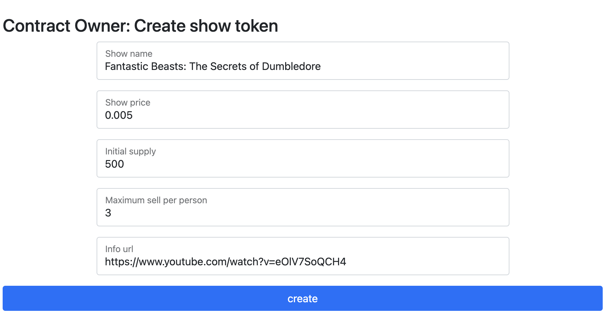
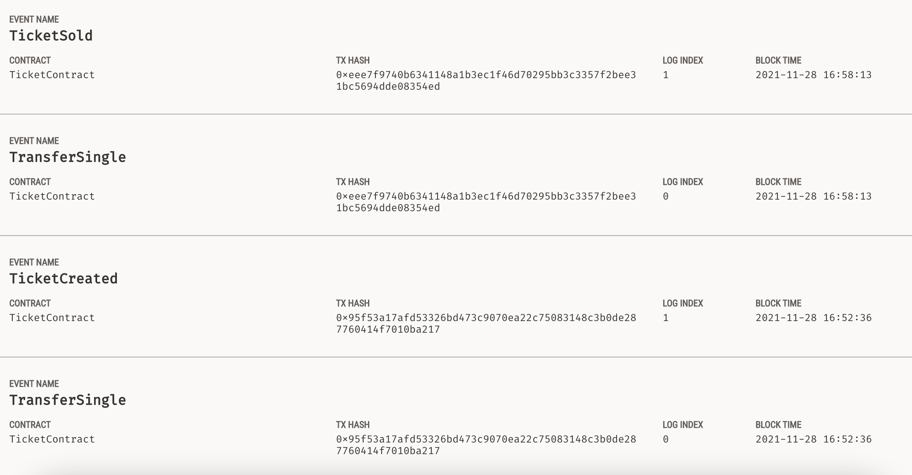

# TicketService: Smart Contract based ticket sell point

Author: Javier Fernando Rojo @javierlinked


# [The idea](./idea.md)

## Live Site

[TicketChain](https://javierlinked-consensys.vercel.app/)


## Walkthrough Video

[Walkthrough video]()


## To Run Locally

### Prerequisites

- Node.js >= v16
- Yarn
- `git clone git@github.com:javierlinked/blockchain-developer-bootcamp-final-project.git`


### Backend

Start [Ganache ui](https://www.trufflesuite.com/ganache) and execute the following commands:

```
cd blockchain-developer-bootcamp-final-project
yarn
truffle migrate --network develop --reset
cd client
yarn
yarn start
```

Then navigate to [http://127.0.0.1:8080](http://127.0.0.1:8080)

Application will ask to sign with your wallet.
The first account in the wallet is the **contract owner** and it's allowed to create **ticket tockens** by filling the form, and setting the price and rest of the data.



Hit create and signt with your wallet. Then wait for the transaction to be shown.

Once a at least one token set has been crated you can switch to an account with balance and buy some of them.
Set a number to buy (it has to be less or equal to the max allowed per person) and hit buy. 
Sign the trasnaction. Payment will be performed and tokens transfered.
Balance is managed by ERC1155 contract.

In the end you can see events created by the contract on Ganache interfase.




**NOTE:** If you receive transaction error and you are using MetaMask, please reset your account and try again.


### Not implemented

- Owner can pause the contract.
- Owner can unpause the contract.
- Owner can see balance of already created tokens.
- Other account can see balance of already bought tokens.
- Owner can burn a token. This is the case when token is used for the show.


### Tests

```
truffle test
```


### Directory structure

```
.
├── client/                  # Dapp
├── contracts/               # Truffle contracts (alternatively `contracts`)
├── migrations/              # Truffle migrations (alternatively `migrations`)
├── test/                    # Automated tests (alternatively `tests`)
├── truffle-config.js        # Truffle config
└── README.md

```


## Public Ethereum wallet for certification

`0x23db5E49544C5A5104316E6eE9734120F3eec357`


## TODO

- [ ] Migrate metadata of a token to a json file in infura or some other offchain solution
- [ ] Use SafeMath.sol for arithmetic operations
- [ ] Move Ownable to roles approach
- [ ] Evaluate `ERC1155PresetMinterPauser`
- [ ] evaluate gas optimizations
- [ ] Change UI to React
- [ ] Add UI for pausable
- [ ] Add a list for onwed tokens both for owner and for others.


## Project requirements:

- [x] Following this naming format https://github.com/YOUR_GITHUB_USERNAME_HERE/blockchain-developer-bootcamp-final-project
- [x] Contain a README.md file which describes the project, describes the directory structure, and where the frontend project can be accessed (see #8). Please also include your public Ethereum account if you would like to receive your certification as an NFT (this is optional). 

- [x] Contain smart contract(s) which:
    - [x] Are commented to the specs described here
    - [x] Use at least two design patterns from the "Smart Contracts" section (SEE A LIST OF DESIGN PATTERNS HERE)
    - [x] Protect against two attack vectors from the "Smart Contracts" section with its SWC number (SEE A LIST OF ATTACK VECTORS HERE)
    - [x] Inherits from at least one library or interface
    - [x] Can be easily compiled, migrated and tested (see #5) (we just need to compile and test it locally.)

- [x] `design_pattern_decisions.md`
- [x] `avoiding_common_attacks.md`

- [x] Have at least five unit tests for your smart contract(s) that pass. 
    - [x] In the code, include a sentence or two explaining what the tests are covering their expected behavior. You are not required to build unit tests for your frontend, just your smart contracts.

- [x] Contain a `deployed_address.txt` file which contains the testnet address and network where your contract(s) have been deployed

- [x] Have a frontend interface built with a framework like React or plain HTML/CSS/JS that:
    - [x] Detects the presence of MetaMask
    - [x] Connects to the current account
    - [x] Displays information from your smart contract
    - [x] Allows a user to submit a transaction to update smart contract state
    - [x] Updates the frontend if the transaction is successful or not
    - [x] Hosted on Github Pages, Netlify, Fleek, Surge, Heroku or some other free frontend service that gives users a public interface to your decentralized application. That address should be in your README.md document.

- [x] In your README.md, be sure to have clear instructions on: 
    - [x] Installing dependencies for your project 
    - [x] Accessing or—if your project needs a server (not required)—running your project
    - [x] Running your smart contract unit tests and which port a local testnet should be running on.

- [x] Note: This section used to require three bash scripts but has been revised.
A screencast of you walking through your project, including submitting transactions and seeing the updated state. You can use a screenrecorder of your choosing or something like Loom, and you can share the link to the recording in your README.md

